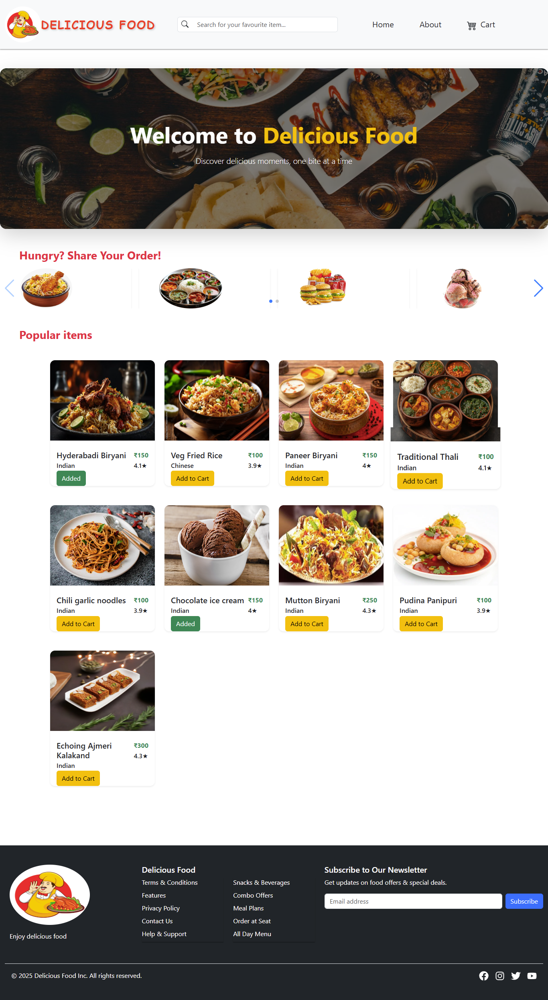
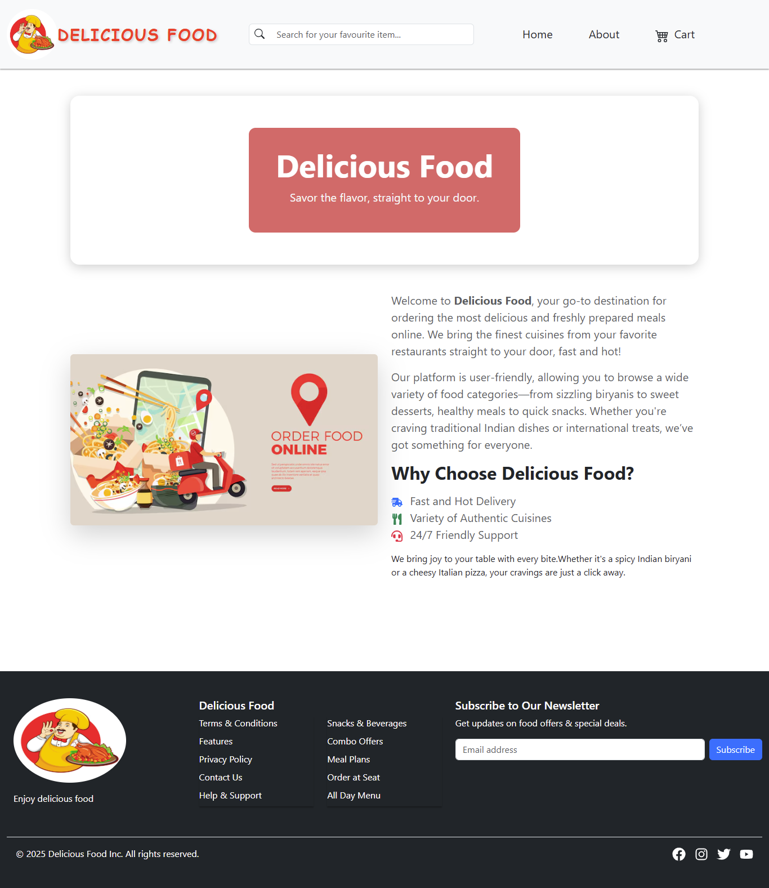
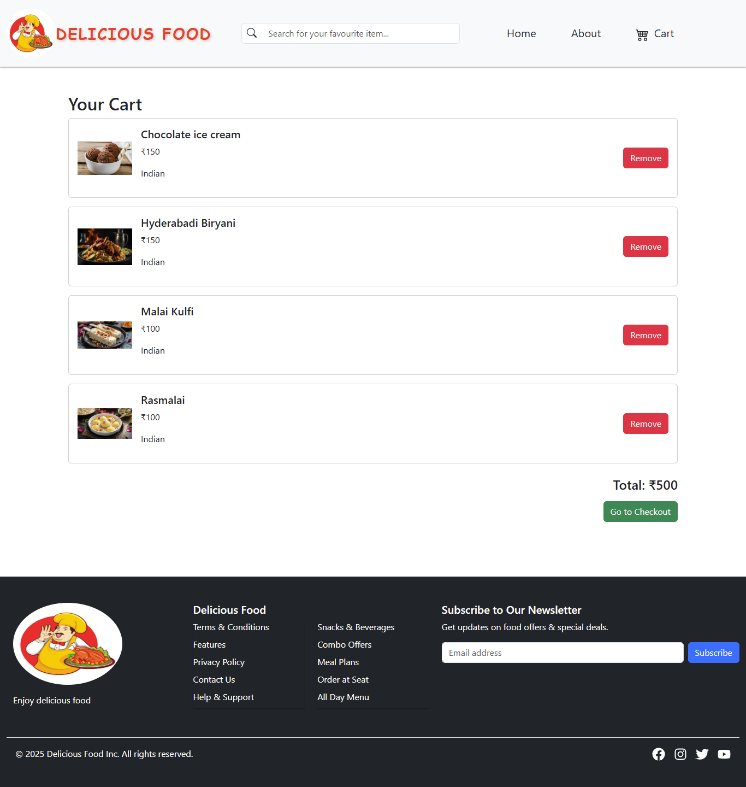
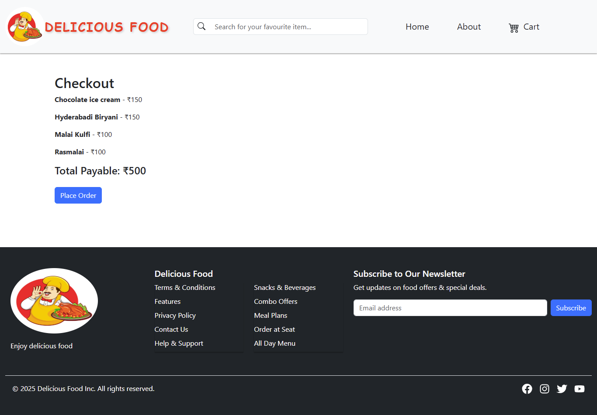

# 🍽️ React Food Delivery App

This is a responsive and interactive Food Delivery Web Application built using **React** and **Vite**. It includes features like user login, restaurant listing, food item details, shopping cart, and checkout.

---

## 🚀 Tech Stack

- [React](https://reactjs.org/) (JSX)
- [Vite](https://vitejs.dev/)
- [React Router DOM](https://reactrouter.com/)
- [Bootstrap](https://getbootstrap.com/)

---

## ✨ Features

- 🔐 **Login Page**
- 🏠 **Home Page** with food categories
- 📃 **Restaurant List** by category
- 📄 **Restaurant Details** view
- 🛒 **Shopping Cart** with add/remove functionality
- ✅ **Checkout page**
- 🔍 **Search functionality**
- 🧾 **404 Page** for undefined routes
- 🧩 **React Router** based navigation
- 🎨 **Bootstrap styling**


1. **Clone the repository:**

   ```bash
   git clone https://github.com/Halimunnisa0127/Frontend-Course.git


---

## 📦 How to Run the Project

1. **Clone the repository:**

   ```bash
   git clone https://github.com/Halimunnisa0127/Frontend-Course.git


    cd Frontend-Course

    cd food-app  # if food-app is a subfolder

    npm install

    npm run dev

http://localhost:5173

## 📸 Screenshots

### 🏠 Home Page  


### 🛒 About Page  


### 🛒 Cart Page  


### ✅ Checkout Page  



## **👩‍💻 Author**


# **Halimunnisa Shaik**
